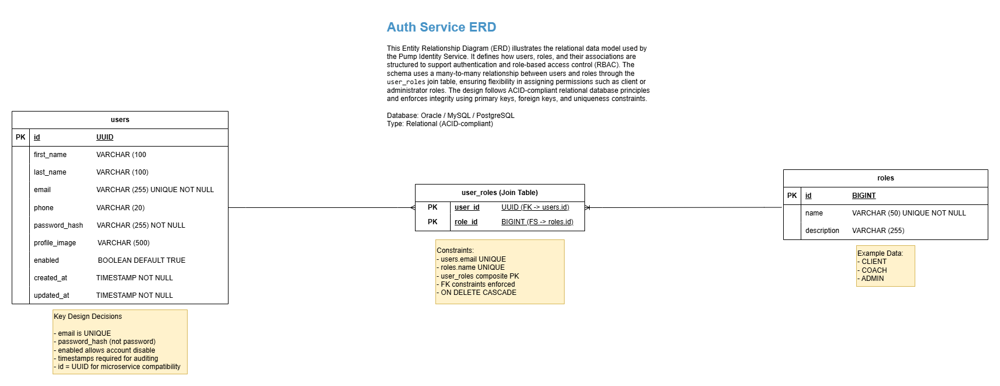

# Pump Auth Service

The **Pump Auth Service** manages authentication, user identity, and role-based access control (RBAC) within the Pump platform.

It provides APIs for:

- User registration
- Login and JWT authentication
- Role management
- Identity validation for other services

This service is part of the **Pump microservices architecture**.

---

# Role in Platform

The Auth Service manages the **identity domain** of the Pump platform.

Other services rely on it to:

- validate user identity
- authorize requests
- manage user roles

### Authentication Flow

    User Login
       ↓
    Auth Service
       ↓
    JWT Token Issued
       ↓
    Other services validate JWT

---

# Technology Stack

| Component | Technology |
|-----------|-----------|
| Backend | Java + Spring Boot |
| Authentication | JWT |
| Database | Oracle |
| ORM | Spring Data JPA |
| Containerization | Docker |
| Orchestration | Kubernetes |

---

# Repository Structure (To update)

    pump-auth-service
    │
    ├─ src/main/java/com/johnmartin/auth
    │   ├─ controllers
    │   ├─ service
    │   ├─ repository
    │   ├─ security
    │   └─ model
    │
    ├─ src/main/resources
    │   ├─ application.yml
    │   ├─ application-dev.yml
    │   ├─ application-docker.yml
    │   └─ application-k8s.yml
    │
    ├─ Dockerfile
    ├─ pom.xml
    └─ README.md

---

# Core Features

### User Management

- Register new users
- Store hashed passwords
- Manage user profiles

### Authentication

- Login with credentials
- Generate JWT tokens
- Token validation

### Role-Based Access Control

Users can have multiple roles.

Example roles:

    CLIENT
    COACH
    ADMIN

---

# Data Model

The Auth Service uses a **relational database schema** for identity management.



### Core Tables

| Table | Purpose |
|------|---------|
| users | stores account information |
| roles | defines system roles |
| user_roles | maps users to roles |

Relationship:

    users 1---* user_roles *---1 roles

---

# Authentication API

### Login Endpoint

POST /api/v1/auth/login

Example request:

```json
{
  "email": "user@email.com",
  "password": "password"
}
```

Example response:

```json
{
  "token": "JWT_TOKEN"
}
```
--- 

# Deployment

The service runs inside a Kubernetes cluster as part of the Pump platform.

Deployment components include:

- Kubernetes Deployment
- ClusterIP Service
- ConfigMaps
- Secrets

Docker images are stored in GitHub Container Registry (GHCR).

--- 

# Running Locally

Clone the repository

    git clone https://github.com/yourusername/pump-auth-service.git

Run application

    mvn spring-boot:run

---

### Run with Docker

Build image:

    docker build -t pump-auth-service .

Run container:

    docker run -p 8080:8080 pump-auth-service

---

# Environment Variables (To update)

Example configuration:

    DB_URL=jdbc:postgresql://localhost:5432/pump_auth
    DB_USERNAME=admin
    DB_PASSWORD=password
    JWT_SECRET=your-secret

In production these values are injected using Kubernetes Secrets and ConfigMaps.

--- 

# Related Repositories

| Repository           | Description                   |
|----------------------|-------------------------------|
| pump-social-service  | Social platform backend       |
| pump-coaching-service | Workout and training features |
| pump-gateway-service | API gateway                   |
| pump  | Flutter mobile client         |

---

# Architecture Principles

This service follows several design principles:
- Microservices architecture
- Database-per-service-pattern
- Stateless authentication
- JWT-based security
- Role-based access control (RBAC)

--- 

# Future Improvements

Potential Improvements:
- OAuth2 / social login
- Refresh tokens
- Account verification
- Password reset

--- 